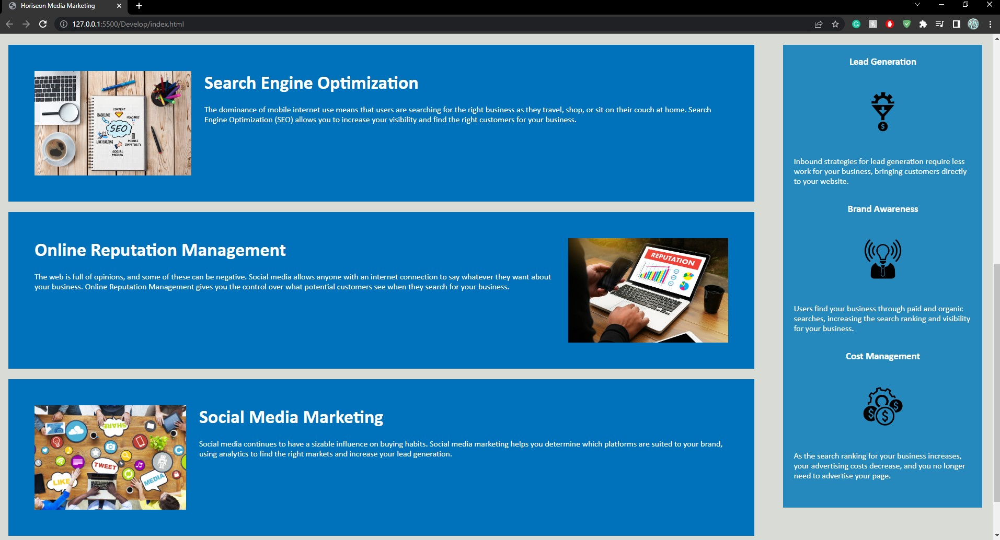
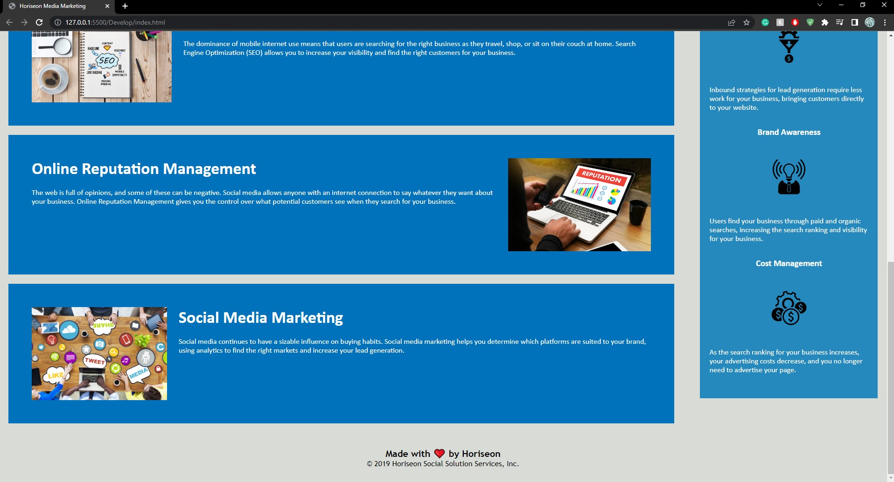

# mod-1-chal

## Description
I was tasked with adding and debugging part of the code for this website. It needed help in regards to semantic HTML structure, meeting accessibility standards,
having proper alt attributes for images, and more. The site now should meet most accessibility standards and have a proper structure and logical styling. I also
fixed broken links which would take you to site resources to learn about the company. It is a fully functional site now.

## Installation
No install required

## Screenshot

